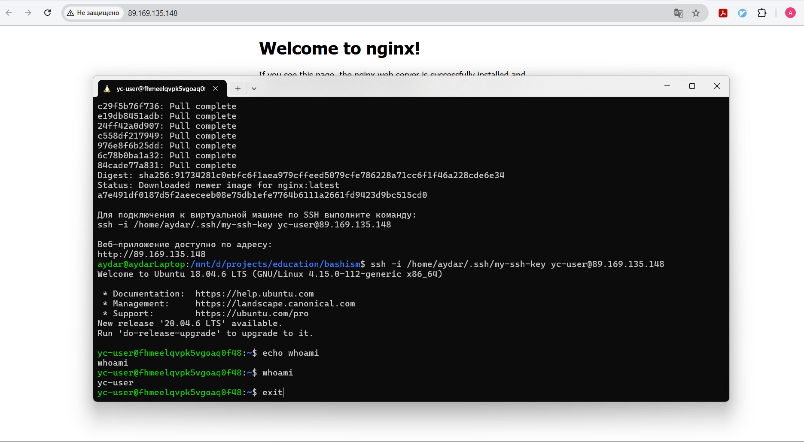

# ipiris

## Задание 1
```bash
chmod +x bulls-and-cows
./bulls-and-cows
```

## Задание 2
```bash
chmod +x tower-of-hanoi
./tower-of-hanoi
```

## Задание 3
```bash
chmod +x deploy_yc.sh
./deploy_yc.sh
```
Результат выполнения deploy_yc.sh



